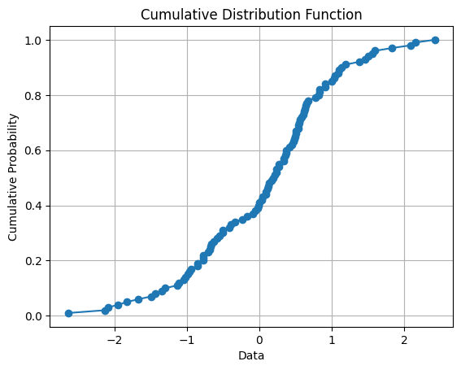

# Cumulative distribution function ( CDF ) plotter

This Python script allows you to plot the Cumulative Distribution Function (CDF) graph for a set of data points. The CDF provides insights into the distribution and cumulative probabilities of the data.

## Introduction
The Cumulative Distribution Function (CDF) is a concept commonly used in statistics and probability theory. It provides a way to describe the probability distribution of a random variable by specifying the probability that the random variable takes on a value less than or equal to a given value.

Mathematically, for a random variable X, the CDF is defined as:

$CDF(x) = P(X ≤ x)$

Where *x* is a specific value of the random variable *X*, and *P(X ≤ x)* denotes the probability that X takes on a value less than or equal to x.

## Exapmle
Let P(X = 6) be the probability of rolling a 6 on a single roll of a six-sided die, which is 1/6 since there are six equally likely outcomes.
Now, let's calculate the cumulative probability of rolling a 6 after each successful try.

1. After the first successful roll:
  * The cumulative probability is $P(X ≤ 6) = P(X = 6) = 1/6$
  * Since it's the first try, the probability of rolling a 6 is the same as the cumulative probability.
    
2. After the second successful roll:
  * The cumulative probability is $P(X ≤ 6) = P(X = 6) + P(X ≤ 6 after the first try)$
  *Since P(X = 6 after the first try) = 1/6, the cumulative probability becomes:
                          $P(X ≤ 6) = 1/6 + 1/6 = 2/6$
    
3. After the third successful roll:
  * The cumulative probability is $P(X ≤ 6) = P(X = 6) + P(X ≤ 6 after the first try) + P(X ≤ 6 after the second try)$.
  * Since $P(X = 6 after the second try) = 1/6$, the cumulative probability becomes:
                            $P(X ≤ 6) = 1/6 + 1/6 + 1/6 = 3/6$
    
In general, after n successful rolls, the cumulative probability P(X ≤ 6) will be:
                            $P(X ≤ 6) = n/6$

As you can see, the cumulative probability of rolling a 6 increases as more successful rolls are achieved. The denominator remains the same (6), while the numerator (n) increases with each successful try, indicating the number of times a 6 has been rolled.

A sample graph for a Cumulative distribution function:


## Requirements

* Python 3.x
* Required libraries: matplotlib, numpy, scipy

## Installation
1. Clone the repository or download the script file.

2. Install the required libraries by running the following command:
   ```
   pip install matplotlib numpy scipy
   ```

## Usage

  run the python script by rumming the following command:
  ```
python3 CDF.py
  ```

## Sources
https://chat.openai.com/
https://en.wikipedia.org/wiki/Cumulative_distribution_function
https://artofsmart.com.au/qcetogether/cumulative-probability-distribution/
